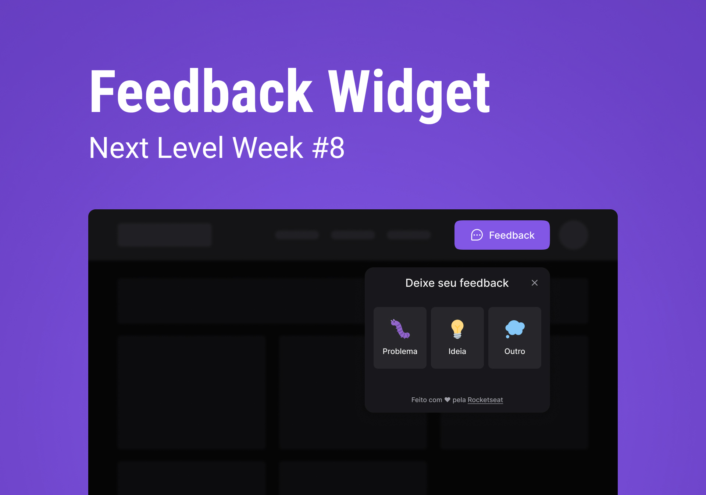

<section align="center">
  <p>
    <a href="#project">Project</a> •
    <a href="#layout">Layout</a> •
    <a href="#getting-started">Getting started</a> •
    <a href="#technologies">Technologies</a> •
    <a href="#extra-mile">Extra mile</a>
  </p>
</section>

<section align="center">
  
</section>

<H2 id="project">:rocket: Project</H2>
<p>
  <strong>Feedget</strong> is a widget to be implemented on any application.
  It allows users to send a screenshot and a comment based on three types of feedbacks: "Bug", "Idea" and "Other".
</p>
<p>
  Project originally created from <a href="https://www.rocketseat.com.br/" target="_blank">Rocketseat</a> and made by <a href="https://github.com/andersonrodolfo" target="_blank">Anderson Rodolfo</a>.
</p>


<H2 id="layout">:bookmark: Layout</H2>
<p>
  Project layout: <a href="https://www.figma.com/community/file/1102912516166573468" target="_blank">Feedback Widget</a>
  (you need to have a <a href="http://figma.com" target="_blank">Figma</a> account to access it).
</p>


<H2 id="getting-started">:open_book: Getting started</H2>


```bash
# Clone this repository
$ git clone https://github.com/andersonrodolfo/feedget.git

# Access the project directory
$ cd feedget
```

<h3>Starting server version:</h3>

```bash
# Access the "server" directory
$ cd server

# Install dependencies
$ yarn

# Run prisma migration
$ yarn prisma migrate dev

# Initialize the server
$ yarn dev
```

<h3>Starting web version:</h3>

```bash
# Access the "web" directory
$ cd web

# Install dependencies
$ yarn

# Initialize the application
$ yarn dev
```

<h3>Starting mobile version:</h3>

```bash
# Access the "mobile" directory
$ cd mobile

# Install dependencies
$ yarn

# Initialize the application
$ expo start
```

<H2 id="technologies">Technologies</H2>

<h4>:globe_with_meridians: Web</h4>
<ul>
  <li><a href="https://reactjs.org/">React</a></li>
  <li><a href="https://www.typescriptlang.org/">Typescript</a></li>
  <li><a href="https://tailwindcss.com/">Tailwindcss</a></li>
  <li><a href="https://vitejs.dev/">Vite</a></li>
  <li><a href="https://headlessui.dev/">Headless UI</a></li>
  <li><a href="https://phosphoricons.com/">Phosphor Icons</a></li>
  <li><a href="https://html2canvas.hertzen.com/">html2canvas</a></li>
  <li><a href="https://axios-http.com/">Axios</a></li>
</ul>

<h4>:iphone: Mobile</h4>
<ul>
  <li><a href="https://reactnative.dev/">React Native</a></li>
  <li><a href="https://www.typescriptlang.org/">Typescript</a></li>
  <li><a href="https://expo.dev/">Expo</a></li>
  <li><a href="https://github.com/duongdev/phosphor-react-native/">Phosphor Icons</a></li>
  <li><a href="https://docs.expo.dev/versions/latest/sdk/splash-screen/">SplashScreen</a></li>
  <li><a href="https://github.com/gorhom/react-native-bottom-sheet">Bottom Sheet</a></li>
  <li><a href="https://github.com/gre/react-native-view-shot">React Native View Shot</a></li>
  <li><a href="https://axios-http.com/">Axios</a></li>
</ul>

<h4>:desktop_computer: Backend</h4>
<ul>
  <li><a href="https://expressjs.com/">Express</a></li>
  <li><a href="https://nodejs.org/pt-br/">NodeJs</a></li>
  <li><a href="https://www.typescriptlang.org/">Typescript</a></li>
  <li><a href="https://www.prisma.io/">Prisma</a></li>
  <li><a href="https://nodemailer.com/about/">Nodemailer</a></li>
  <li><a href="https://jestjs.io/">Jest</a></li>
</ul>

<H2 id="extra-mile">Extra mile</H2>

<h6>:globe_with_meridians: Web</h4>
<ul>
  <li>Add eslint, commitlint, husky and prettier</li>
  <li>Fake homepage</li>
  <li>Responsive menu</li>
  <li>Dark/Light theme toggle</li>
  <li>Toast</li>
</ul>

<h6>:desktop_computer: Server</h6>
<ul>
  <li>Error handling</li>
  <li>Email html changes</li>
</ul>
  


